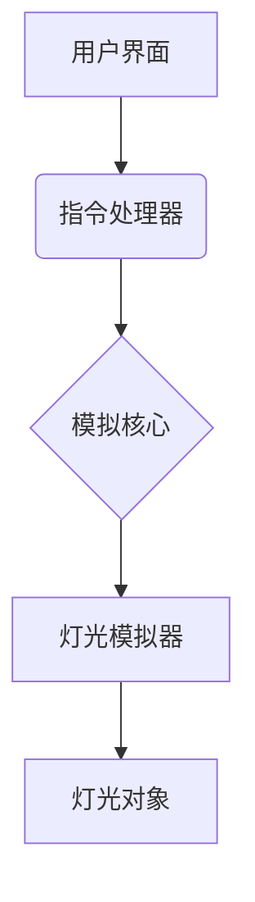

# 领跑灯模拟软件概要设计

## 1. 系统架构

本系统将采用模块化设计，主要分为三个核心部分：

*   **模拟核心 (Simulation Core)**: 负责处理所有与灯光行为模拟相关的逻辑。
*   **指令处理器 (Command Processor)**: 负责解析和分发指令。
*   **用户界面 (User Interface)**: 提供用户交互的图形界面。

## 2. 模块设计

### 2.1 模拟核心 (Simulation Core)

这是系统的核心，负责管理所有灯光对象和模拟循环。

*   **灯光对象 (`PacerLight`)**: 每一个灯都是一个对象，包含以下属性：
    *   `id`: 灯的唯一标识符。
    *   `brightness`: 当前亮度 (0-255)。
    *   `state`: 当前状态 (e.g., `IDLE`, `FADING_IN`, `HOLDING`, `FADING_OUT`)。
    *   `timer`: 用于控制状态转换的计时器。
*   **模拟循环 (`SimulationLoop`)**: 一个持续运行的循环，在每个时间步长（tick）中更新所有灯的状态和亮度。

### 2.2 指令处理器 (Command Processor)

负责接收来自用户界面的指令，并将其分发给相应的灯光对象。

*   **指令解析 (`parseCommand`)**: 将原始指令字符串或数据结构解析为标准格式。
*   **指令分发 (`dispatchCommand`)**: 遍历所有灯光对象，根据`Id-Mask`确定哪些灯需要响应指令，并调用相应灯光对象的`executeCommand`方法。

### 2.3 用户界面 (User Interface)

提供一个图形化界面，用于与用户交互。

*   **灯光配置视图**: 允许用户添加、删除和配置灯光（例如，设置ID）。
*   **指令控制面板**: 提供输入字段，让用户可以构建并发送指令。
*   **模拟视图**: 实时显示所有灯光的状态，可以通过颜色、大小或亮度值来可视化灯光。

## 3. 数据流

1.  用户在**用户界面**上构建一条指令并点击“发送”。
2.  **用户界面**将指令发送给**指令处理器**。
3.  **指令处理器**解析指令，并根据`Id-Mask`确定目标灯光。
4.  **指令处理器**调用目标**灯光对象**的方法，传递指令参数（`Brightness`, `FadeIn`, `Hold`, `FadeOut`）。
5.  **灯光对象**根据接收到的指令更新自己的内部状态（例如，从`IDLE`切换到`FADING_IN`）。
6.  **模拟核心**的**模拟循环**在每个tick中检查所有灯光对象的状态。
7.  如果一个灯处于`FADING_IN`、`HOLDING`或`FADING_OUT`状态，**模拟循环**会根据时间的推移更新其`brightness`属性。
8.  **用户界面**的**模拟视图**定期从**模拟核心**获取所有灯光的状态，并更新显示。

## 4. 技术选型（建议）

*   **编程语言**: Python (因其快速开发和丰富的库生态系统)。
*   **UI框架**: 采用Web技术。
    *   **前端**: 使用现代JavaScript框架，如 React 或 Vue，以实现快速开发和丰富的可视化。
    *   **后端**: 使用Python的Web框架（如 Flask 或 FastAPI）来驱动模拟核心，并通过WebSocket与前端通信。
*   **可视化**: 利用HTML/CSS和JavaScript库（如D3.js或PixiJS）来创建动态、可交互的灯光模拟视图。